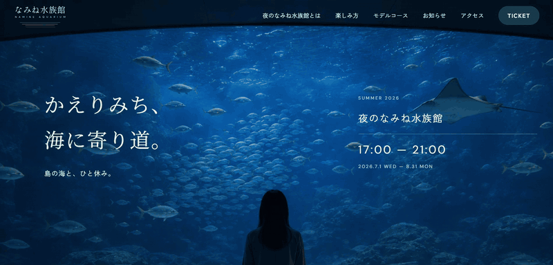

# 夜のなみね水族館

架空の市営水族館「なみね水族館」の、夏季限定・夜間営業特設サイト(就職活動用ポートフォリオ)。

🔗 **公開URL**: https://7chillgo-tech.github.io/night-namine-aquarium/

| | |
|---|---|
| 制作期間 | 2026年7月29日〜8月21日(約3週間半) |
| 担当範囲 | 企画・デザイン・コーディングすべて |
| 制作環境 | Figma / VS Code / Git・GitHub |

## 概要

離島にある市営の水族館、という設定で企画しました。島の人口がそもそも少なく、
来館者の年齢層も固定化しつつある中で、リピーターをどう増やすかが課題です。
そこで「夜間営業」という新しい体験を用意し、今は足が遠のいている年代にも
もう一度訪れたいと思ってもらうことを狙いました。

集客数や売上を前面に出すのではなく、日常の中にある少しだけ特別な体験を
届けたいと考えました。そのため「映える」方向には振らず、落ち着いた雰囲気で
ゆっくり過ごせる場所であることが伝わる設計にしています。夜のイベントサイトに
寄りすぎないよう、メインカラーに温かい色味を取り入れ、親しみやすさを残しました。

## ページ構成

| ページ | ファイル | 内容 |
|---|---|---|
| TOP | `index.html` | 水族館とは・楽しみ方・モデルコース・お知らせ・アクセス・チケット案内を1ページに集約 |
| チケット | `ticket.html` | 夜間営業の概要・料金表・注意事項・購入導線 |
| お知らせ一覧 | `news.html` | TOPページのお知らせセクションの一覧版 |

モデルコース・イベント詳細は下層ページに分ける構成も検討しましたが、「仕事帰りに
ふらっと寄り道する」という短い動線を想定していたため、スクロールだけで完結する
TOP1ページに集約しました。チケットとお知らせは、営業時間や料金をあとから確認し直す
場面が多いと考え、単独ページとして残しています。

## 使用技術

- HTML5 / CSS3(素の記述、フレームワーク・プリプロセッサ不使用)
- JavaScript(素の記述、ライブラリ不使用)
- Google Fonts:DM Sans / Zen Kaku Gothic New / Noto Serif JP
- GitHub Pages(ホスティング)
- Figma(デザイン)

ビルドツール不要の静的サイトのため、`index.html` をブラウザで開くだけで動作します。

## こだわったポイント

- **写真・グラデーション・余白でセクション間の世界観をつなぐ**:セクションごとに背景を
  切り替えると境目が"段差"に見えてしまうため、INTROとHOW TO ENJOYは1枚の背景
  (`.intro-how-to-bg`)としてまとめて扱いました。中心位置をずらした円形グラデーションを
  3つ重ね、深い青(`#52A1B1`)からクリーム(`#F3F0E8`)へ、水面に浮かび上がるように色を
  送っています。写真は円形に切り抜いたうえでグロー(`box-shadow`)で縁をにじませ、背景と
  地続きに見せました。**このグローの色はグラデーションの最も内側と同じ色に揃えてあり**、
  写真だけが背景から浮くのを防いでいます。あわせてセクション間の余白を大きく取り、
  切り替わりを断絶ではなく"間"として感じられるようにしました。
- **星座線のスクロール演出**:スクロール量ではなく、線の実際の座標
  (`getPointAtLength`)から進み具合を計算する方式にしました。単純にスクロール量に
  比例させると、線がジグザグに振れる区間で不自然に止まって見えたためです。JSはほぼ
  独学だったので、線の曲がり具合や星の座標はブラウザで確認しながら何度も微調整しました。
- **レスポンシブの切り替え幅の決め方**:横並びから縦積みに切り替える幅を、1024pxと
  900pxの両方で試しました。1024pxだと写真が405×228→944×531と一気に2倍以上に
  跳ねてしまうため、変化がなだらかな900pxを採用しています。写真の枠も固定pxから
  `aspect-ratio: 16 / 9` に変え、元画像(732×412)とほぼ同じ比率にすることで、
  どの画面幅でも切り取りがほぼ起きないようにしました。

## 今後の展望

- 画像の色味を統一し、実際に撮影した写真への差し替え
- 画像のWebP化と `<picture>` での出し分け(現状は背景画像が最大965KBあり、
  低速回線での初期表示に改善の余地があります)
